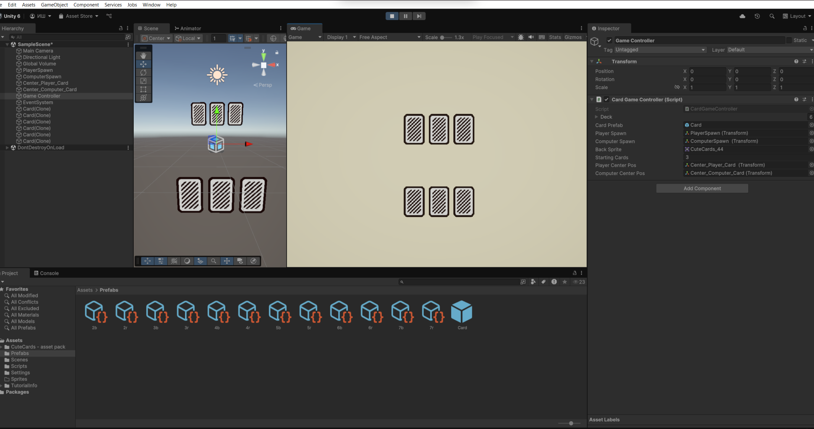

# Card Game

## Описание проекта

**Card Game** — это прототип карточной игры на Unity, реализующий базовые механики сравнения карт, элементальные эффекты, способности и визуальные фидбэки. Игра предназначена для демонстрации архитектуры с использованием префабов, Scriptable Objects, событий и визуальных эффектов.

В игре два участника: игрок и компьютер. Каждый раунд соперники раскрывают карты, сравнивают значения и элементы, а способности и эффекты добавляют стратегическую глубину в процесс.

---

## Скриншоты

### Главная сцена и структура объектов

_Иерархия сцены, контроллер игры, спавны и префабы карт._

### Процесс баттла и консоль ошибок

_Раунд сравнения карт, отображение ошибок и логов в консоли Unity._

### Сравнение карт и элементальные эффекты

_В центре — сравнение карт игрока и компьютера, всплывающие эффекты и индикация способностей._

### Экран победы и результат раунда

_Сообщение о победе, количество карт, итог сравнения и визуальные эффекты._

---

## Core Gameplay Mechanics

### 1. Basic Card Battle System
- Сравнение карт игрока и компьютера
- Случайный выбор карт из руки
- Сравнение силы (power) для определения победителя
- Условия победы/проигрыша/ничьи

### 2. Deck System
- Перемешивание колоды при старте игры
- Вытягивание карт обоими игроками
- Удаление карт из колоды после вытягивания
- Настраиваемый стартовый размер руки

### 3. Hand Management
- Визуальное отображение карт в руке
- Карты противника показываются рубашкой
- Отслеживание количества карт

---

## Elemental Affinity System

### 4. Element Types
- Огонь (Fire), Вода (Water), Земля (Earth)
- Нейтральный элемент (None)

### 5. Elemental Strengths/Weaknesses
- Огонь побеждает Землю (в 2 раза сильнее)
- Земля побеждает Воду (в 2 раза сильнее)
- Вода побеждает Огонь (в 2 раза сильнее)
- Слабые элементы наносят половинный урон

### 6. Elemental Visuals
- Цветные партиклы при баттле
- Иконки элементов на картах
- Цветовая индикация элементов

---

## Special Ability System

### 7. Ability Types
- Draw Extra: вытянуть доп. карту при победе
- Steal Card: украсть карту соперника при победе
- Destroy on Loss: уничтожить карту оппонента при проигрыше
- Double Power: усилить силу при проигрыше
- Revive Random: вернуть случайную карту из колоды

### 8. Ability Triggers
- Активация способности при победе
- Активация способности при проигрыше
- Условная активация

### 9. Ability Visuals
- Пульсирующая индикация способностей
- Уникальные иконки для каждого типа
- Цветовые выделения карт со способностями
- Сообщения об активации способности

---

## Visual Feedback Systems

### 10. Card Display
- Разные позиции для карт игрока/компьютера
- Центральная зона для баттла
- Отображение артов и спрайтов карт

### 11. Game State Feedback
- Сообщения о результате раунда
- Уведомления об активации способностей
- Отображение количества карт
- Анонсы Game Over

---

## Game Flow Mechanics

### 12. Round System
- Запуск раунда по клавише пробел
- Автоматическое обновление руки после раунда
- Задержка между раундами для просмотра эффектов

### 13. Game Progression
- Автоматическая проверка условий победы
- Сброс игры после победы
- Непрерывный игровой цикл

### 14. UI System
- Счетчики карт игрока/компьютера
- Текст результата баттла
- Всплывающие сообщения о способностях

---

## Technical Mechanics

### 15. Object Pooling
- Создание/уничтожение карт
- Управление партиклами эффектов
- Отслеживание карт по тегам

### 16. Game Balancing
- Настраиваемый размер стартовой руки
- Регулировка значений способностей
- Настройка множителей элементов

---

## Технологии

- **ShaderLab** — визуальные эффекты и материалы
- **C#** — игровая логика, контроллеры, UI
- **HLSL** — кастомные шейдеры
- **Mathematica** — генерация/обработка игровых данных

---

## Как запустить

1. Откройте проект в Unity 6.
2. Запустите сцену `SampleScene`.
3. Нажмите Play — игра начнется автоматически.

---

## Планы по развитию

- Добавить больше правил и режимов
- Реализовать мультиплеер
- Улучшить визуальные эффекты, UI, анимации
- Добавить новые способности и элементы

---

## Автор

**ivanshevchuk0**

---

Есть вопросы или предложения? Создайте issue или pull request!
